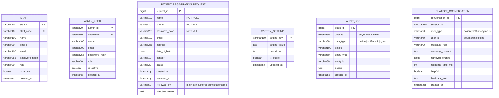

# Hospital Smart Queue System — ER Diagram

> **Audited and verified** against the actual PostgreSQL schema (V1–V6 migrations),
> model classes, repositories, and service logic.
>
> The schema is split into three focused diagrams so the relationships remain readable.

---

## Diagram 1 — Core Queue Flow

```mermaid
erDiagram

    DEPARTMENT {
        serial    department_id PK
        varchar10 department_code UK
        varchar100 department_name
        boolean   is_active
        timestamp created_at
    }

    DOCTOR {
        varchar20 doctor_id PK
        varchar10 doctor_code UK
        varchar100 name
        int       department_id FK "NOT NULL"
        varchar100 specialization
        varchar20 phone
        varchar100 email
        varchar255 password_hash "nullable"
        int       max_queue_size
        time      queue_open_time
        time      queue_close_time
        int       average_consultation_minutes
        boolean   is_available
        boolean   is_active
        timestamp created_at
        timestamp updated_at
    }

    PATIENT {
        varchar20 patient_id PK
        varchar100 name
        varchar20  phone UK "NOT NULL"
        varchar255 password_hash
        varchar100 email
        varchar255 address
        date       date_of_birth
        varchar10  gender
        boolean    is_new_patient
        timestamp  registered_at
        timestamp  updated_at
    }

    PRIORITY {
        serial     priority_id PK
        varchar20  priority_code UK
        varchar50  priority_name
        int        sort_order
        numeric5_2 weight
        boolean    is_active
    }

    QUEUE {
        bigint     queue_id PK
        varchar30  queue_number
        varchar20  patient_id FK "NOT NULL"
        varchar20  doctor_id FK "NOT NULL"
        int        department_id FK "NOT NULL"
        varchar20  priority "string, NOT FK"
        varchar20  status
        int        position
        bigint     estimated_waiting_time
        varchar20  source
        boolean    is_emergency
        boolean    emergency_confirmed
        timestamp  called_at
        timestamp  started_at
        timestamp  paused_at
        timestamp  completed_at
        timestamp  cancelled_at
        text       cancel_reason
        timestamp  created_at
        timestamp  checked_in_at
    }

    QUEUE_HISTORY {
        bigint     history_id PK
        bigint     queue_id "logical ref, no FK constraint"
        varchar30  queue_number
        varchar20  patient_id
        varchar20  doctor_id
        varchar20  status
        text       change_reason
        timestamp  created_at
    }

    APPOINTMENT {
        bigint     appointment_id PK
        varchar20  patient_id FK "NOT NULL"
        varchar20  doctor_id FK "NOT NULL"
        int        department_id FK "NOT NULL"
        date       appointment_date
        time       appointment_time
        varchar20  status
        bigint     queue_id "logical ref, no FK constraint — set on check-in"
        text       notes
        timestamp  created_at
    }

    NOTIFICATION {
        bigint     notification_id PK
        varchar20  patient_id FK "NOT NULL"
        varchar1000 message
        boolean    is_read
        timestamp  created_at
    }

    DEPARTMENT   ||--o{ DOCTOR       : "employs"
    DEPARTMENT   ||--o{ QUEUE        : "contains"
    DEPARTMENT   ||--o{ APPOINTMENT  : "has"

    PATIENT      ||--o{ QUEUE        : "joins"
    PATIENT      ||--o{ APPOINTMENT  : "books"
    PATIENT      ||--o{ NOTIFICATION : "receives"

    DOCTOR       ||--o{ QUEUE        : "attends"
    DOCTOR       ||--o{ APPOINTMENT  : "holds"

    QUEUE        |..o{ QUEUE_HISTORY : "logged by"
    APPOINTMENT  }o--o| QUEUE         : "linked to (optional)"
```

### Notes — Priority Table

The `priority` table exists as a **standalone lookup/reference table** (`priority_code`, `priority_name`, `sort_order`, `weight`).
However, `queue.priority` stores the priority as a **plain `VARCHAR(20)` string** (`'EMERGENCY'`, `'APPOINTMENT'`, `'NORMAL'`) — there is **no FK constraint** to `priority(priority_code)`.

The application uses **hardcoded string comparisons** in the rule engine (`EmergencyRule`, `PriorityRule`, `QueueRule`) rather than looking up the `priority` table.

The `priority` table is retained in the schema as metadata for the smart queue engine but is **not normalized as a FK**.

### Notes — Appointment ↔ Queue

The `appointment.queue_id` column is a **nullable FK** to `queue(queue_id)`.

- **Walk-in patients**: A queue entry is created directly — `appointment.queue_id` remains `NULL`.
- **Appointment check-in**: When a patient checks in for an appointment, a queue entry is created first, then `appointment.queue_id` is updated to reference it.
- **Cardinality**: One queue entry can be linked to at most one appointment (in practice 1:1 or 0..1:1). The FK lives on the `appointment` side.

---

## Diagram 2 — AI & ML Features

```mermaid
erDiagram

    QUEUE {
        bigint queue_id PK
        varchar20 patient_id FK
        varchar20 doctor_id FK
        int    department_id FK
    }

    PATIENT {
        varchar20 patient_id PK
    }

    DOCTOR {
        varchar20 doctor_id PK
    }

    DEPARTMENT {
        serial department_id PK
    }

    APPOINTMENT {
        bigint appointment_id PK
        varchar20 patient_id FK
        varchar20 doctor_id FK
    }

    ML_MODEL {
        bigint     model_id PK
        varchar100 model_name UK
        varchar50  model_type
        varchar50  framework
        varchar20  version
        varchar500 file_path
        varchar500 artifacts_path
        jsonb      metrics_json
        boolean    is_active
        timestamp  trained_at
        timestamp  deployed_at
        varchar100 created_by
        text       description
    }

    WAIT_TIME_PREDICTION {
        bigint     prediction_id PK
        bigint     queue_id FK "nullable, ON DELETE SET NULL"
        varchar20  patient_id FK "nullable, ON DELETE SET NULL"
        varchar20  doctor_id FK "nullable, ON DELETE SET NULL"
        int        department_id FK "nullable, ON DELETE SET NULL"
        bigint     model_id FK "nullable, ON DELETE SET NULL"
        jsonb      features_json "NOT NULL"
        numeric6_2 predicted_wait_min
        numeric6_2 actual_wait_min
        timestamp  predicted_at
        timestamp  resolved_at
        numeric6_2 error_minutes "GENERATED"
        numeric6_2 absolute_error "GENERATED"
    }

    NOSHOW_PREDICTION {
        bigint     prediction_id PK
        bigint     appointment_id FK "NOT NULL, ON DELETE CASCADE"
        varchar20  patient_id FK "nullable, ON DELETE SET NULL"
        varchar20  doctor_id FK "nullable, ON DELETE SET NULL"
        bigint     model_id FK "nullable, ON DELETE SET NULL"
        jsonb      features_json "NOT NULL"
        numeric4_3 predicted_probability
        varchar10  risk_level
        numeric4_3 threshold_used
        boolean    predicted_noshow
        boolean    actual_noshow
        timestamp  predicted_at
        timestamp  resolved_at
    }

    TRIAGE_ASSESSMENT {
        bigint     assessment_id PK
        varchar20  patient_id FK "nullable, ON DELETE SET NULL"
        bigint     queue_id FK "nullable, ON DELETE SET NULL"
        int        department_id FK "nullable, ON DELETE SET NULL"
        text       symptoms_text
        varchar10  recommended_dept_code
        boolean    emergency_flag
        int        acuity_score "CHECK 1-5"
        varchar20  disposition
        jsonb      recommended_tests
        jsonb      recommended_labs
        text       reason
        boolean    ai_used
        varchar50  model_version
        int        staff_acuity_score
        varchar20  staff_disposition
        text       staff_notes
        varchar50  reviewed_by "plain string, no FK"
        timestamp  reviewed_at
        timestamp  created_at
    }

    QUEUE_ACUITY_LOG {
        bigint     log_id PK
        bigint     queue_id FK "NOT NULL, ON DELETE CASCADE"
        bigint     triage_id FK "nullable, ON DELETE SET NULL"
        int        original_priority
        int        escalated_priority
        int        acuity_score
        varchar20  disposition
        varchar100 escalation_reason
        varchar50  triggered_by
        timestamp  created_at
    }

    ML_MODEL          ||--o{ WAIT_TIME_PREDICTION : "generates"
    ML_MODEL          ||--o{ NOSHOW_PREDICTION    : "generates"

    QUEUE             ||--o{ WAIT_TIME_PREDICTION : "predicted for"
    PATIENT           ||--o{ WAIT_TIME_PREDICTION : "tracked for"
    DOCTOR            ||--o{ WAIT_TIME_PREDICTION : "tracked for"
    DEPARTMENT        ||--o{ WAIT_TIME_PREDICTION : "tracked for"

    APPOINTMENT       ||--o{ NOSHOW_PREDICTION    : "predicted for"
    PATIENT           ||--o{ NOSHOW_PREDICTION    : "tracked for"
    DOCTOR            ||--o{ NOSHOW_PREDICTION    : "tracked for"

    PATIENT           ||--o{ TRIAGE_ASSESSMENT    : "assessed for"
    QUEUE             ||--o{ TRIAGE_ASSESSMENT    : "assessed by"
    DEPARTMENT        ||--o{ TRIAGE_ASSESSMENT    : "assessed for"

    QUEUE             ||--o{ QUEUE_ACUITY_LOG     : "escalated via"
    TRIAGE_ASSESSMENT |..o{ QUEUE_ACUITY_LOG      : "triggers"
```

---

## Diagram 3 — Admin & System



### Notes — Standalone Tables

**STAFF** and **ADMIN_USER** are **intentionally separate authentication entities** with no FK constraints to other tables. They are not polymorphic — they are distinct user types with separate login flows.

**`reviewed_by`** fields in `triage_assessment` and `patient_registration_request` are **plain `VARCHAR(50)` strings** — they store a username/staff identifier but have no FK constraint. This is a deliberate design choice (the application does not enforce referential integrity on these fields).

**AUDIT_LOG** and **CHATBOT_CONVERSATION** use **polymorphic user references** (`user_id` + `user_type` as plain strings). This is intentional — the system supports multiple user types (patients, staff, admins, anonymous) and uses a single table for each.

---

## Relationship Summary

| Parent | Child | Cardinality | FK Location | Nullable? | Notes |
|---|---|---|---|---|---|
| DEPARTMENT | DOCTOR | 1 : N | `doctor.department_id` | NOT NULL | Enforced by FK constraint |
| DEPARTMENT | QUEUE | 1 : N | `queue.department_id` | NOT NULL | Enforced by FK constraint |
| DEPARTMENT | APPOINTMENT | 1 : N | `appointment.department_id` | NOT NULL | Enforced by FK constraint |
| PATIENT | QUEUE | 1 : N | `queue.patient_id` | NOT NULL | Enforced by FK constraint |
| PATIENT | APPOINTMENT | 1 : N | `appointment.patient_id` | NOT NULL | Enforced by FK constraint |
| PATIENT | NOTIFICATION | 1 : N | `notification.patient_id` | NOT NULL | Enforced by FK constraint |
| DOCTOR | QUEUE | 1 : N | `queue.doctor_id` | NOT NULL | Enforced by FK constraint |
| DOCTOR | APPOINTMENT | 1 : N | `appointment.doctor_id` | NOT NULL | Enforced by FK constraint |
| QUEUE | QUEUE_HISTORY | 1 : N | `queue_history.queue_id` | NULLABLE | No FK constraint, logical reference only |
| QUEUE | APPOINTMENT | 1 : 0..1 | `appointment.queue_id` | NULLABLE | Set on check-in; walk-ins stay NULL |
| QUEUE | WAIT_TIME_PREDICTION | 1 : N | `wait_time_prediction.queue_id` | NULLABLE | ON DELETE SET NULL |
| QUEUE | TRIAGE_ASSESSMENT | 1 : N | `triage_assessment.queue_id` | NULLABLE | ON DELETE SET NULL |
| QUEUE | QUEUE_ACUITY_LOG | 1 : N | `queue_acuity_log.queue_id` | NOT NULL | ON DELETE CASCADE |
| APPOINTMENT | NOSHOW_PREDICTION | 1 : N | `noshow_prediction.appointment_id` | NOT NULL | ON DELETE CASCADE |
| PATIENT | WAIT_TIME_PREDICTION | 1 : N | `wait_time_prediction.patient_id` | NULLABLE | ON DELETE SET NULL |
| PATIENT | NOSHOW_PREDICTION | 1 : N | `noshow_prediction.patient_id` | NULLABLE | ON DELETE SET NULL |
| PATIENT | TRIAGE_ASSESSMENT | 1 : N | `triage_assessment.patient_id` | NULLABLE | ON DELETE SET NULL |
| DOCTOR | WAIT_TIME_PREDICTION | 1 : N | `wait_time_prediction.doctor_id` | NULLABLE | ON DELETE SET NULL |
| DOCTOR | NOSHOW_PREDICTION | 1 : N | `noshow_prediction.doctor_id` | NULLABLE | ON DELETE SET NULL |
| DEPARTMENT | WAIT_TIME_PREDICTION | 1 : N | `wait_time_prediction.department_id` | NULLABLE | ON DELETE SET NULL |
| DEPARTMENT | TRIAGE_ASSESSMENT | 1 : N | `triage_assessment.department_id` | NULLABLE | ON DELETE SET NULL |
| ML_MODEL | WAIT_TIME_PREDICTION | 1 : N | `wait_time_prediction.model_id` | NULLABLE | ON DELETE SET NULL |
| ML_MODEL | NOSHOW_PREDICTION | 1 : N | `noshow_prediction.model_id` | NULLABLE | ON DELETE SET NULL |
| TRIAGE_ASSESSMENT | QUEUE_ACUITY_LOG | 1 : N | `queue_acuity_log.triage_id` | NULLABLE | ON DELETE SET NULL |

## Standalone Tables (no FK constraints)

| Table | Purpose | Design Notes |
|---|---|---|
| PRIORITY | Lookup table for queue priority levels | **Not normalized as FK** — `queue.priority` stores string directly |
| STAFF | Hospital staff accounts | Intentionally separate auth entity |
| ADMIN_USER | System admin accounts | Intentionally separate auth entity |
| SYSTEM_SETTING | Key-value configuration store | Standalone by design |
| AUDIT_LOG | System-wide audit trail | Polymorphic `user_id`+`user_type` (plain strings) |
| PATIENT_REGISTRATION_REQUEST | Pending registrations (approved → PATIENT) | `reviewed_by` stores admin username string |
| CHATBOT_CONVERSATION | RAG chatbot history | Polymorphic `user_id`+`user_type` (plain strings) |
